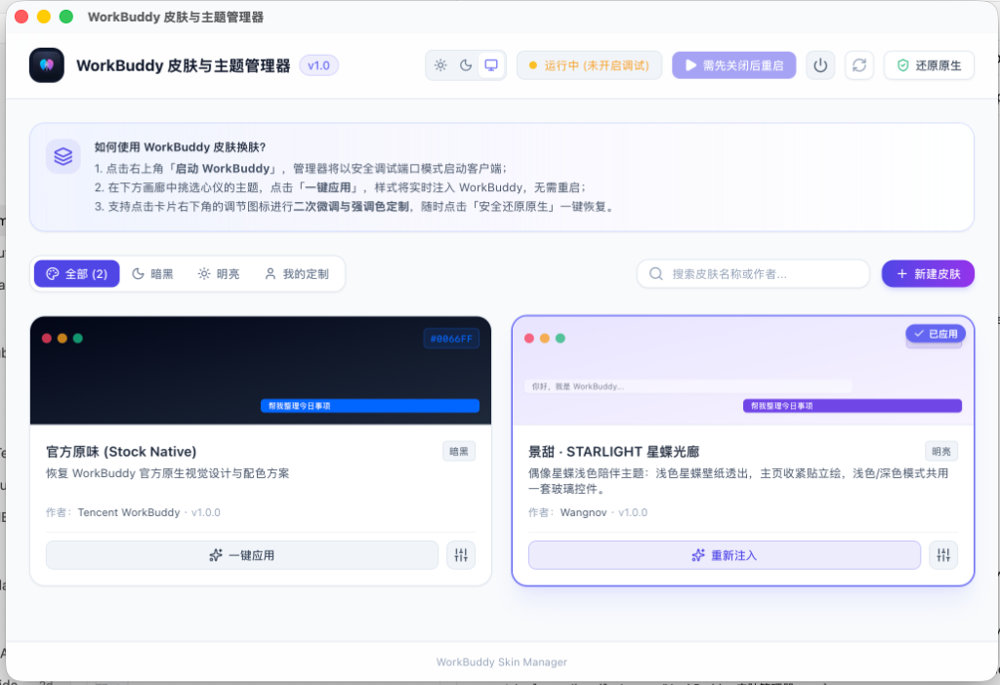
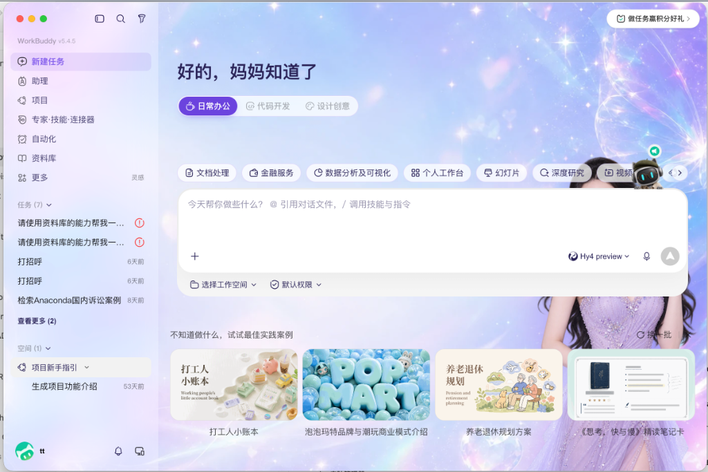
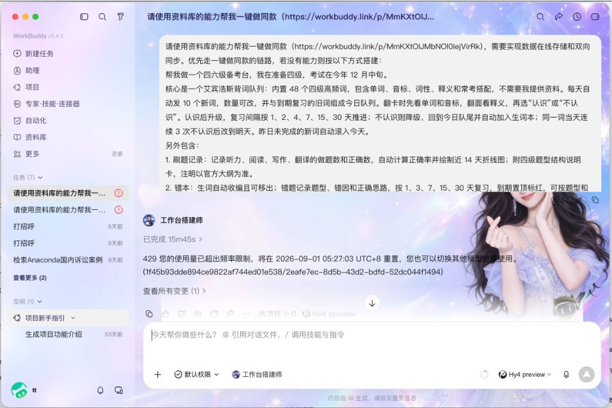

<h1 align="center">WorkBuddy 皮肤与主题管理器</h1>

<p align="center">
  专为 WorkBuddy 桌面客户端打造的非侵入式热换肤与主题管理工具
</p>

<p align="center">
  <a href="https://github.com/245678000000/workbuddy-theme-manager/actions/workflows/release.yml">
    
  </a>
  <a href="https://github.com/245678000000/workbuddy-theme-manager/releases">
    
  </a>
  
  
</p>

<p align="center">
  
</p>

---

## 实装效果展示

### 「景甜 · STARLIGHT 星蝶光廊」浅色陪伴主题

| 首页极光星蝶效果 | 任务会话半透明毛玻璃效果 |
| :---: | :---: |
|  |  |

---

## 核心特性

- **跨平台原生支持**：深度适配 **macOS**（Apple Silicon & Intel）与 **Windows**（Windows 10 / 11 64-bit）桌面系统。
- **非侵入式热换肤**：基于 Chrome DevTools Protocol（CDP）向运行中的 WorkBuddy 页面会话注入 CSS/Tokens，不修改客户端本体文件，不破坏官方代码签名。
- **即时生效无需重启**：在客户端运行过程中实时切换、调试与注入主题皮肤，零延迟刷新。
- **一键安全还原**：提供原生样式还原机制，一键卸载注入图层，恢复官方默认外观。
- **主题外观适配**：
  - 内置精选主题预设（如「景甜 · STARLIGHT 星蝶光廊」与「官方原生」）；
  - 管理器自身支持浅色、深色及跟随操作系统三态外观模式切换。
- **可视化微调器**：支持强调色提取、主透明度、毛玻璃模糊度（含 0px 极简模式）、自定义壁纸上传与 CSS 实时热载入。
- **自动检测更新**：集成 GitHub Releases API，支持启动时静默检查与手动检查，提供更新日志展示与一键安装引导。
- **GitHub Actions 自动构建**：提供完备的 CI/CD 发布流水线，推送 Git 标签即可自动编译全平台 macOS DMG 与 Windows EXE/MSI 安装包并发布 Release。

---

## 系统架构

```text
┌─────────────────────────────────────────────────────────────┐
│                 WorkBuddy Skin & Theme Manager              │
│                                                             │
│  ┌─────────────────────────┐       ┌─────────────────────┐  │
│  │     React 19 Frontend   │       │   Tauri v2 / Rust   │  │
│  │  - Theme Gallery UI     │  IPC  │  - Process Detector │  │
│  │  - Visual Customizer    │──────▶│  - Skin Compiler    │  │
│  │  - GitHub Auto Updater  │       │  - CDP Session Mgr  │  │
│  └─────────────────────────┘       └──────────┬──────────┘  │
└───────────────────────────────────────────────┼─────────────┘
                                                │ CDP (WebSocket)
                                                │ Port 9333
                                                ▼
                                     ┌─────────────────────┐
                                     │ WorkBuddy Desktop   │
                                     │ (Runtime DOM Inject)│
                                     └─────────────────────┘
```

---

## 快速安装与使用

### 下载安装包

访问 [GitHub Releases](https://github.com/245678000000/workbuddy-theme-manager/releases) 下载适合您操作系统的最新安装包：

#### 🍏 macOS
- Apple Silicon (M1/M2/M3/M4)：`WorkBuddy-Skin-Manager-v1.0.0-macOS-arm64.dmg`
- Intel 芯片：`WorkBuddy-Skin-Manager-v1.0.0-macOS-x64.dmg`
- 免安装绿色包：`WorkBuddy-Skin-Manager-v1.0.0-macOS-arm64.zip`

> 下载后打开 DMG 镜像，将应用拖拽至 `Applications`（应用程序）文件夹即可。

#### 🪟 Windows
- 64 位安装包：`WorkBuddy-Skin-Manager-Setup-x64.exe`
- MSI 安装包：`WorkBuddy-Skin-Manager-x64.msi`

> 双击安装程序按照向导完成安装，桌面将自动生成快捷方式。

---

## 本地开发指南

### 前置环境

- Node.js >= 18
- pnpm >= 9
- Rust 稳定版 (2021 edition) 与 Cargo
- 操作系统：macOS (macOS 12+) 或 Windows (Windows 10/11 64-bit)

### 1. 安装依赖

```bash
pnpm install
```

### 2. 启动前端预览（Mock 模式）

```bash
pnpm dev
```

在浏览器访问 `http://localhost:1420` 即可预览 UI 界面（Mock 环境下不会连接真实 WorkBuddy 进程）。

### 3. 启动桌面端开发服务

```bash
pnpm tauri dev
```

### 4. 运行全栈质量门禁

```bash
pnpm check
```

该命令将严格执行 TypeScript 类型检查、Vitest 前端单元测试、Rust Cargo 单元测试以及 Vite 生产构建。

---

## 使用步骤

1. 打开「WorkBuddy 皮肤管理器」，点击右上角 **「启动 WorkBuddy」**。管理器将在 9333 端口空闲时启动 WorkBuddy 并附加 `--remote-debugging-port=9333`。
2. 待右上角指示状态变为 **「CDP 已连接」** 后，在下方画廊中选择喜欢的主题，点击 **「一键应用」** 即可瞬间换肤。
3. 可点击皮肤卡片右下角的调节图标，进入微调器调节色彩、壁纸与毛玻璃参数，支持「保存修改」或「另存为新皮肤」。
4. 点击右上角 **「还原原生」** 可随时清空注入的自定义样式，安全恢复官方原生界面。

---

## GitHub 发布与持续更新

本项目已配置 GitHub Actions 自动构建流水线（`.github/workflows/release.yml`）。发布新版本只需以下步骤：

```bash
# 1. 运行一键版本自增与门禁脚本（以 1.0.1 为例）
./scripts/release.sh 1.0.1

# 2. 推送代码与标签至 GitHub
git push origin main --tags
```

推送完成后，GitHub Actions 会自动在云端编译各平台（macOS / Windows）安装包并创建 Release，所有客户端将自动检测到该更新。

---

## 许可证与免责声明

本项目采用 [MIT License](LICENSE) 开源协议。

**免责声明**：本项目为独立开源工具，通过官方支持的 Chromium 调试协议（CDP）在本地内存中注入样式，不包含任何对 WorkBuddy 安装包本体文件的篡改与破解行为。
